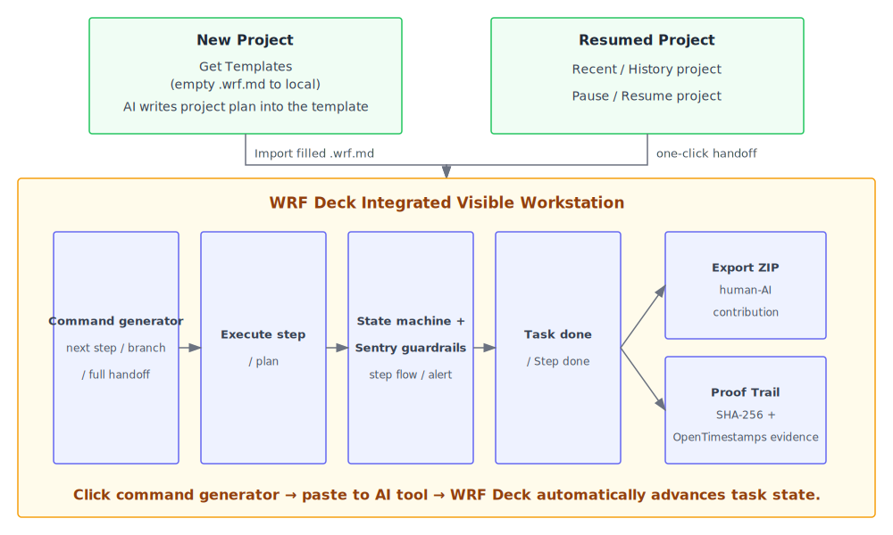
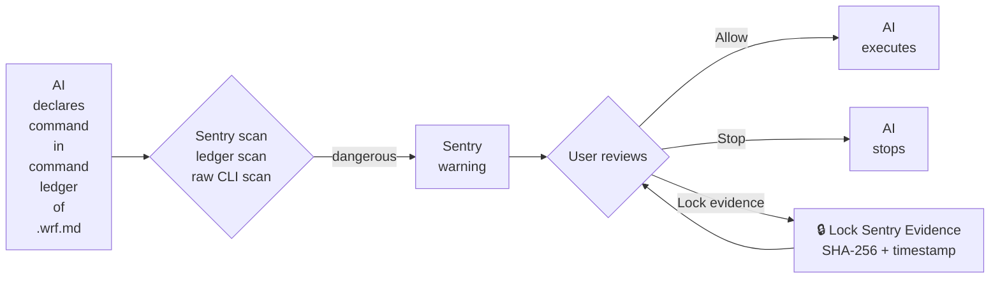

<div align="center">
  <h2>WRF DECK</h2>
  <p><strong>Sentry, multi-AI handoff, and human-AI contribution evidence</strong></p>
  
  <br>
  <a href="LICENSE"></a>
  <a href="https://1g10k.dev/workflow-recovery"></a>
  <a href="https://1g10k.dev/workflow-recovery"></a>
  <br>
  <sub style="color: #1f77b4;">English · 简体中文 · Français · Español · Português (Brasil) · 日本語 · Deutsch · हिन्दी</sub>
</div>
<br>

**A local-first, single-file workspace for AI workflows — no install required.**

Reference implementation of the **open WRF protocol** — one file, **any AI tool**, zero lock-in.

**[Try WRF DECK](https://1g10k.dev/workflow-recovery)** · **[Watch the demo](https://1g10k.dev)**

---

## What problem does it solve?

- **Dangerous commands.** Executing without warning, forcing you to manually capture evidence under stress.
- **Pause-and-resume cost.** You cannot step away freely. Every meeting or break forces you to spend time and tokens rebuilding context.
- **Context drift.** Context window limits that cause drift, forgotten constraints, or confident hallucinations.
- **Tool-switching overhead.** Repeating goals, constraints, and progress every time you switch tools.
- **Multi-task switching cost.** Running multiple AI tasks at once makes continuous working state hard to manage.
- **Team handoff overhead.** Handing off work requires detailed explanations; remote voice or email handoffs are awkward.
- **Human-AI contributions blurred.** Human creative direction is scattered across chat histories, making it hard to extract, archive, and one-click generate a clear human-vs-AI contribution file.
- **Missing proof.** The inability to instantly capture execution content and automatically generate a verifiable hash proof during normal work or incidents.

**WRF (Workflow Recovery Framework) is the protocol**. It defines how task state is stored in a single `.wrf.md` file.

**WRF Deck** is the **visual workspace** that runs the protocol — **not another AI editor.** It reads the file, manages step transitions, enforces Sentry guardrails, generates handoff commands, and keeps human direction separate from AI checkpoints. Your AI tools only handle the actual work; WRF Deck keeps the state consistent. It is a parallel layer that monitors the same file your tools read and write. Change the AI tool; keep the WRF file.

---

## Origin

WRF Deck came from an accident I personally experienced: in April 2026, a destructive command wiped 170 GB of work and family data from my D: drive during an AI-assisted coding session. Afterward I reconstructed the full chain of events and reviewed nearly every reported AI incident from 2025–2026. That became the motivation and basis for building WRF Deck.

The full public record is preserved at [1g10k.dev/my-story](https://1g10k.dev/my-story).

---

## WRF DECK in one picture



## Why would AI tools follow a .wrf protocol file?

AI tools usually ignore the "rules section" inside the protocol. WRF Deck works because its **built-in command generator** produces a **dynamic structured instruction** for each step as the plan advances. The protocol requirements are encoded inside that instruction: how to update `.wrf.md`, which fields to fill, which checkpoints to record, which commands must be declared before execution, and so on.

The instruction structure has been **battle-tested in real use**. The AI is not asked to "please follow the WRF protocol"; it is reinforced when the step holds the model's full attention, so its natural output is a `.wrf.md` update in the required format. When every step is framed this way, protocol execution becomes the most natural way for the AI to complete the task correctly — and its default path.

In day-to-day use, Claude, Claude Code, Gemini, GitHub Copilot, ChatGPT, VS Code Copilot Chat, and other AI tools have all written back to `.wrf.md` accurately, without exception.

---

## Core capabilities

### Step-aware command generation

WRF Deck reads the active step from `.wrf.md` and builds a structured command. The command updates as the step updates, so you can keep the task moving **without typing unconstrained, casual prompts** like "execute", "do it", or "what's next". Only add a note when you want to give creative direction, constraints, or corrections.

1. **[Copy Next Step Command](docs/images/copy-next-step-command.png).** Click to generate the live step command for the active step, then paste it directly to AI.

2. **[Copy Branch Task Command](docs/images/copy-branch-task-command.png).** Click to dispatch quick detours, experiments, or **unrelated tasks** without advancing the main line. This creates an instant, zero-overhead sandbox—once completed, the session seamlessly pivots back to the active parent step, letting you resume exactly where you left off.

3. **Record human contribution.** The note you add is embedded into the command as your instruction. Check `Record this note as human contribution evidence` to log your instruction separately from AI checkpoints, so it can be included in the exported contribution report.

### How Sentry works



Any terminal command, file deletion, or system-mutating action is recorded in `command_ledger`. This isn't the AI judging on its own, or a static suggestion. It is a structured instruction automatically generated by **Copy Next Step Command** and injected into the AI context each time the user triggers the next step. When a `command_ledger` entry matches the built-in dangerous-command pattern library, the command is flagged as `dangerous` and set to `pending`, and the AI must STOP and wait for your confirmation; **even if a dangerous command is not correctly recorded in `command_ledger`, Sentry's raw CLI pattern scan can still detect it in the persisted `.wrf.md` trace as long as it appears anywhere in the file**. A red warning banner also appears at the top of the WRF Deck workspace to reinforce the alert. You can also click **🔒 Lock Sentry Evidence** first to seal the current WRF source file together with a Sentry incident summary, generating a timestamped SHA-256 hash proof.

WRF is a behavioral protocol layer, not an execution-path layer. It does not replace sandboxes, agent gateways, or kernel-level hard interception. The Command Ledger's "record first, match dangerous patterns, STOP, and wait for confirmation" mechanism rebuilds a human-approval workflow at the declaration layer, while Sentry provides a second-pass detection on the persisted trace.

Most current agent guardrails rely on an external classifier that judges an entire Bash call as one block, so a dangerous sub-command hidden inside a compound script can be misclassified or bypassed. WRF moves the guardrail inside the AI's own context, forces every command to be declared before execution, and verifies those declarations against both structured ledger entries and raw dangerous CLI patterns.


*Sentry warning banner: intercepted command, risk analysis, and the Lock Evidence button.*


*One-click evidence lock confirmation with SHA-256 hash proof.*

### Instant handoff

Whenever a task needs to hand off context, `.wrf.md` plus WRF Deck makes it instant: switching AI tools, pausing and resuming later, picking up a teammate's work, or returning to an older project. Your AI tools write the **full execution state** into `.wrf.md` step by step, following the step-level instructions — step roadmap, active step, completed checkpoints with evidence, strategic notes, and next-step preview. `.wrf.md` records **continuous execution state**. Because it is a **single file**, any AI tool can take over the task and continue exactly from the breakpoint; WRF Deck provides a **visual workspace** that displays the full execution state the moment you import the protocol, enabling immediate continuation and monitoring.

Three ways to hand off:

1. **Copy Step Handoff** — hand off the active step with its full execution context: project goal, step locator, status, completed checkpoints with evidence, current execution state, and next-step preview. Includes safety instructions so the receiving tool does not auto-advance the step.
2. **Copy Full Handoff** — hand off the complete project snapshot: project strategy, all completed steps with evidence, current execution status, next-step plan, and a safety stop point with required alignment actions.
3. **Re-import `.wrf.md`** — share the file itself. Any AI tool can open it and resume exactly where you left off.

`.wrf.md` is the single source of truth; the handoff buttons are a controlled context-distribution mechanism with built-in safety protocols — trimmed context, explicit stop points, and required alignment — so the receiving tool resumes from the exact state instead of advancing on its own. Use a handoff snapshot on its own for an instant clipboard transfer, or pair it with the `.wrf.md` file for a full protocol-level handoff.

### Switch AI tools without losing context

WRF Deck keeps the full task state, history, and constraints in a single `.wrf.md` file. Because every AI tool reads and writes the same file, you can move the same task across Claude, Copilot, Gemini, or any other tool through an instant handoff.

**Typical handoff flow:**

1. **Plan.** Ask Claude to write the plan into `.wrf.md`.
2. **Load.** Import the `.wrf.md` into WRF Deck and click the command generator to push the task forward; WRF Deck auto-advances task state.
3. **Switch.** When you want to use a different AI tool, click **Copy Step Handoff** or **Copy Full Handoff**, then paste it into the new tool. The handoff is instant — the new tool already has the local `.wrf.md` file and the handoff snapshot, so it understands every task detail without further explanation.
4. **Continue.** The new tool performs its part and updates `.wrf.md`.
5. **Switch again.** Repeat step 3 whenever you want to move to another tool.

### Run multiple tasks in parallel

Running multiple AI tools in parallel usually brings three problems:

1. **Parallel sessions are limited.** Two already feel like the limit. Go beyond that and context switching becomes painful — too many tasks in progress can quickly become a nightmare to manage.
2. **State gets lost.** With multiple AI sessions running, it is easy to lose track of details, dependencies, progress, and what each agent was supposed to do next.
3. **Management and coordination become the bottleneck.** With each AI tool holding its own fragment of the state, you end up tracking who is working on what, sequencing commits, and keeping tasks from colliding. Past a few parallel tasks, that overhead becomes unmanageable.

WRF Deck solves this by giving each task its own `.wrf.md` file — a single source of truth that records the full execution state: roadmap, active step, completed checkpoints with evidence, strategic notes, and next-step preview. Open one WRF Deck workspace per task. You can pause, switch tools, or continue tasks without losing the state of any single one, and visualize, inspect, and hand off any task instantly.

### Team handoff

In short, team members only need to hand off `.wrf.md`. Even a single email is enough — the recipient imports the file into WRF Deck and can take over immediately.

### Human contribution

WRF Deck faithfully records the instructions you add while working: creative direction, constraints, and corrections to AI mistakes. All of this goes into `humanDirectionNotes` inside `.wrf.md`, stored separately from the AI's `completed_checkpoints`. At any time, click **Export Human-AI Contribution Evidence** in the Start menu to download a ZIP containing the full `.wrf.md` and a `Human-AI Contribution Chronology Report` (`authorship-summary.html`) that surfaces every human-led instruction.

### Proof Trail

Proof Trail is a lightweight evidence panel on the right side of the WRF Deck workspace. Drag any file into it to generate a local SHA-256 hash and timestamp without leaving your workspace or opening another site. You can submit the hash to OpenTimestamps, export the proof, or copy a badge to paste on GitHub, your project page, or app store listings.

1. **Sentry evidence lock.** When Sentry detects a destructive command and shows the red warning banner, you do not need to drag anything or decide what to save under pressure. Click **🔒 Lock AI Evidence** and WRF Deck automatically captures the current `.wrf.md` source together with a Sentry incident summary — including the intercepted command, line number, and impact analysis — hashes it, and saves it to Proof Trail history so you can export the evidence package at any time.

2. **Fragmented daily evidence.** Drop in files as you code, tweak configs, or run scripts to snapshot their state. The hash record is there when you need to show what existed at a specific moment.

3. **Human-contribution ZIP evidence.** After exporting the human-contribution ZIP, drag it straight into Proof Trail to timestamp both the `.wrf.md` and `authorship-summary.html` together.

The saved Sentry evidence appears in Proof Trail with options to verify the hash, export the proof, submit to OpenTimestamps, or copy a badge:


*Proof Trail record: timestamp, SHA-256 hash, and action buttons.*

---

## Why this saves tokens

Writing a `.wrf.md` file looks like extra work, but it replaces repeated context. Without WRF, every tool switch or task resume means re-sending goals, constraints, current state, and often parts of the codebase. With WRF, the file carries that state. Compared to the tokens spent re-syncing context on every handoff, tool switch, pause-and-resume, or task switch, the tokens used to maintain the `.wrf.md` file are negligible.

---

## Quick start

1. Get the latest WRF protocol template:
   ```bash
   curl -L https://github.com/1G10K/wrf-protocol/raw/main/templates/wrf/execution-track.wrf.md -o execution-track.wrf.md
   ```
2. Ask your AI tool to generate a plan with `.wrf.md` for the project you want to build. The AI automatically fills steps, goals, and guardrails into the `execution-track.wrf.md` template according to the WRF protocol requirements.
3. Click **Import to Start** and import the planned `execution-track.wrf.md`.
4. Click **Copy Next Step Command** or **Copy Branch Task Command**, paste it into your AI tool, and let the AI execute step by step. Use **Copy Step Handoff** or **Copy Full Handoff** when you switch tools.

See [docs/GETTING_STARTED.md](docs/GETTING_STARTED.md) for a longer walkthrough.

---

## Documentation

- [Full tutorial](docs/GETTING_STARTED.md) — first-time setup and a sample task
- [WRF Protocol Specification](docs/SPEC.md) — **canonical reference for tool builders**: file format, block structure, handoff rules, Sentry contract, and how to build a WRF-compatible tool
- [WRF Light SDK Integration Guide](docs/SDK_GUIDE.md) — Zero-dependency programmatic helper for developers, scripts, and agent tool builders
- [Provenance & Prior Art](docs/PROVENANCE.md) — Bitcoin blockchain evidence of the WRF protocol's existence on 2026-05-28

---

## Who is this for?

- **Solo developers and AI-native engineers** switching between AI tools and want one file to track state, progress, and handoffs.
- **Small teams and product squads** where different members use different AI tools on the same project.
- **Platform teams, tech leads, and enterprises** that need to coordinate multiple AI tools, run parallel tasks, and get warnings plus one-click evidence capture for dangerous commands.
- **Tool builders, IDE plugin developers, and agent framework authors** who want to programmatically parse and update standard `.wrf.md` state layers using our zero-dependency **[WRF Light SDK](wrf-sdk.ts)** and seamlessly integrate their developer tools with the **[WRF Deck visual workspace](https://1g10k.dev)** out of the box.

---

## WRF Compliant Badge

If your open-source project, IDE extension, or agent pipeline complies with the WRF protocol, we invite you to display the official compliance badge at the top of your repository's `README.md`:

```markdown
[](https://1g10k.dev/workflow-recovery)
```

**Display Preview:**

[](https://1g10k.dev/workflow-recovery)

---

## Project structure

```text
.
├── README.md
├── README.zh-CN.md
├── CHANGELOG.md
├── wrf-sdk.ts                             # Zero-dependency TypeScript library for programmatic read/write
├── templates/
│   └── wrf/
│       ├── execution-track.wrf.md          # blank WRF protocol execution track template
│       └── execution-track.wrf.md.sha256   # SHA-256 checksum for the template
├── docs/
│   ├── SPEC.md                             # protocol specification
│   ├── GETTING_STARTED.md                  # tutorial
│   ├── SDK_GUIDE.md                        # Light SDK integration and programmatic guide
│   ├── PROVENANCE.md                       # Bitcoin blockchain evidence of prior art
│   ├── images/                             # README screenshots
│   │   ├── wrf-deck-workspace.png          # README hero screenshot
│   │   ├── copy-next-step-command.png      # Copy Next Step Command dialog
│   │   ├── copy-branch-task-command.png    # Copy Branch Task Command dialog
│   │   ├── sentry-alert-banner.png             # Sentry dangerous-command warning banner
│   │   ├── sentry-evidence-locked.png           # Sentry evidence locked dialog
│   │   └── proof-trail-record.png               # Proof Trail timestamped hash record
│   ├── wrf-overview-en.svg                 # WRF Deck overview diagram (English)
│   └── wrf-overview-zh.svg                 # WRF Deck overview diagram (Chinese)
└── LICENSE                                 # Apache-2.0
```

---

## FAQ

**Q: Where is my project data stored?**

A: WRF Deck is local-first. Your `.wrf.md` files stay on your own filesystem. WRF Deck reads and writes them locally in your browser; they are not uploaded to our servers.

**Q: Can I use WRF without WRF Deck?**

A: Yes. The WRF protocol is an open format documented in [`docs/SPEC.md`](docs/SPEC.md). Any tool, IDE plugin, agent, or script can read and write `.wrf.md` files. We provide a zero-dependency **[WRF Light SDK](wrf-sdk.ts)** and an [Integration Guide](docs/SDK_GUIDE.md) to help developer tools, IDE extensions, or CLI agents read and update states programmatically in minutes. By adopting this standard, your tools can seamlessly leverage the **[1G10K Visual Workspace](https://1g10k.dev)** for interactive monitoring and compliance management with zero frontend development overhead.

**Q: Why does Proof Trail verification show "pending"?**

A: That is normal. After you submit to OpenTimestamps (OTS), the Bitcoin blockchain anchor needs to be confirmed by the network. This typically takes anywhere from a few hours up to 7 days, depending on OTS aggregation and block timing. You can click **Verify** again after a longer interval, or check the status directly on [opentimestamps.org](https://opentimestamps.org).

---

## License

Apache-2.0 — see [LICENSE](LICENSE).

## Contributing

We welcome pull requests for new templates, third-party tool adapters, and documentation translations. The core WRF protocol specification is maintained by the 1G10K team so that compatibility and upgrade paths stay consistent. If you want to propose a protocol change, please open an issue first.
