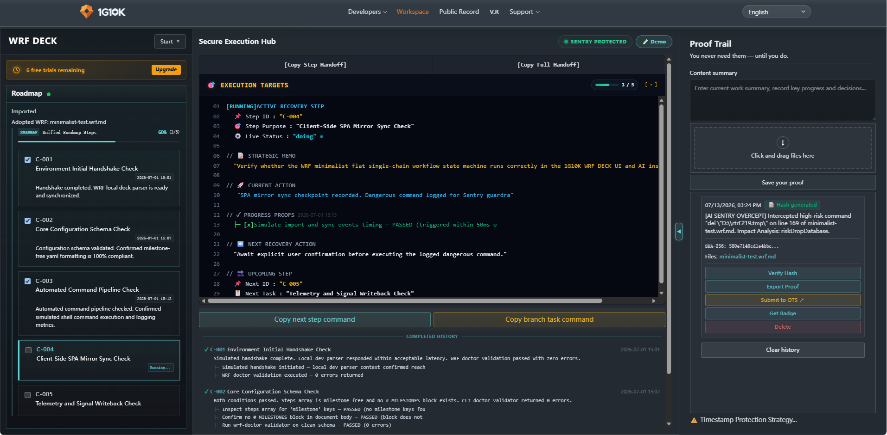
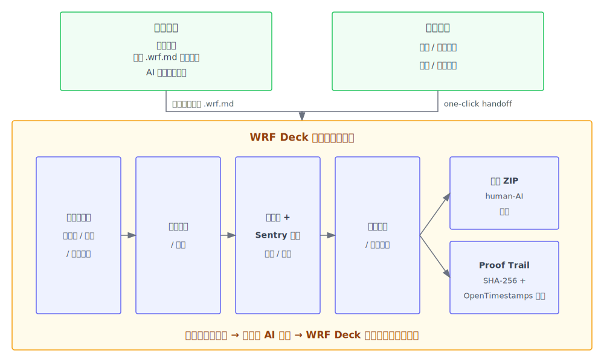
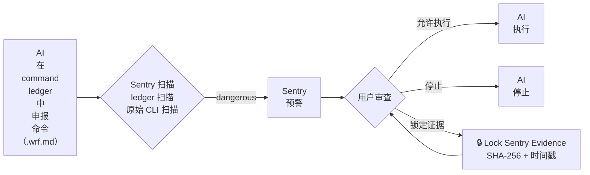
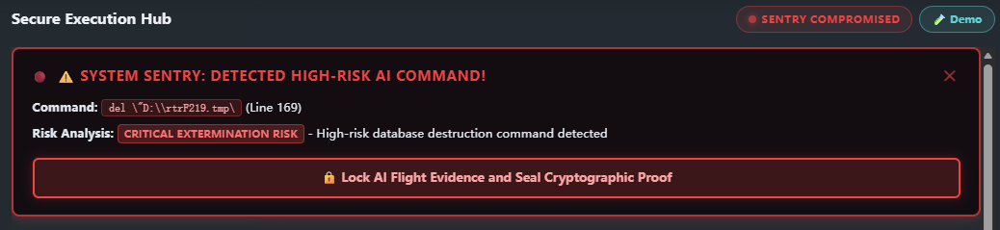
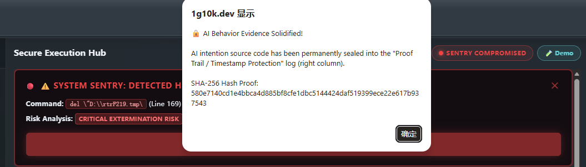
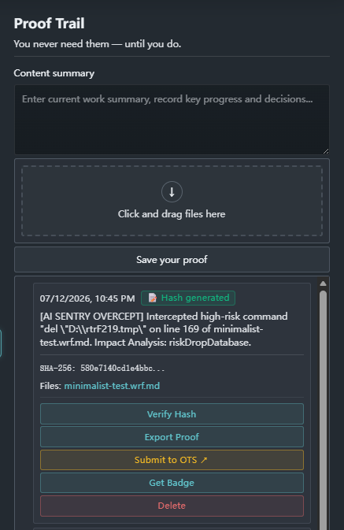

<div align="center">
  <h2>WRF DECK</h2>
  <p><strong>哨兵、多 AI 工具交接与人机贡献存证</strong></p>
  
  <br>
  <a href="LICENSE"></a>
  <a href="https://1g10k.dev/workflow-recovery"></a>
  <a href="https://1g10k.dev/workflow-recovery"></a>
  <br>
  <sub style="color: #1f77b4;">English · 简体中文 · Français · Español · Português (Brasil) · 日本語 · Deutsch · हिन्दी</sub>
</div>
<br>

**本地优先的 AI 工作流单文件工作空间——无需下载安装。**

开放 **WRF 协议**的参考实现——一份文件、**任意 AI 工具**、零锁定。

**[体验 WRF DECK](https://1g10k.dev/workflow-recovery)** · **[观看演示](https://1g10k.dev)**

---

## 解决什么问题？

- **危险命令。** 执行前无预警，一旦出事，你只能手忙脚乱地手动留证。
- **暂停恢复成本。** 你不能随意离开。每次因会议或休息中断，都要花时间和 token 重新恢复上下文。
- **工具切换成本。** 每次切换工具都要重复交代目标、限制条件和进度。
- **上下文偏移。** 上下文窗口有限，导致目标漂移、关键约束遗忘或 AI 自信猜测。
- **状态混乱。** 同时运行多个 AI 任务时，连续工作状态难以统一管理。
- **人机贡献难分。** 人类创意指令散落在各个 AI 工具的聊天记录中，难以提取、归档，更无法一键生成清晰的人类与 AI 贡献文件。
- **缺失存证。** 日常工作或遭遇异常命令时，难以一键抓取执行内容并自动生成可验证的哈希存证。

**WRF（Workflow Recovery Framework）是协议**。它定义了如何把任务状态保存在单一 `.wrf.md` 文件中。

**WRF Deck** 是运行该协议的 **可视化工作区**——**不是又一个 AI 编辑器**。它读取该文件，管理步骤流转、执行 Sentry 护栏、生成交接命令，并把人类指令与 AI 执行记录分开存储。你的 AI 工具只负责实际执行工作，WRF Deck 负责让状态保持一致。它是一个并行层，监控着你的 AI 工具正在读写的同一个文件。AI 工具可以换，WRF 文件不变。

---

## 起源

WRF Deck 源于我亲身经历的一次事故：2026年4月，在一次 AI 辅助编码过程中，我 D 盘上的 170 GB 工作数据和家庭资料因一条破坏性命令被清空。事后我仔细分析了事故发生的全过程，并调研了 2025–2026 年几乎所有被公开报道的 AI 事故，这成为开发 WRF Deck 的动因和依据。

完整公开记录保存在 [1g10k.dev/my-story](https://1g10k.dev/my-story)。

---

## WRF DECK 全景图



## 为什么 AI 工具会按 .wrf 协议文件执行？

AI 工具通常会直接忽略协议内的「规则章节」。WRF Deck 能做到，是因为它**内置的命令生成器会随计划步骤的推进给出动态结构化指令**。协议的要求被编码在这条指令内部：如何更新 `.wrf.md`、该填哪些字段、哪些检查点必须记录、哪些命令执行前必须申报等等。

指令的结构经过严格测试，AI 不是被请求「请遵守 WRF 协议」，而是在每个步骤的注意力峰值被强化，其自然输出就是按要求格式更新 `.wrf.md`。当每一步都以这种方式构建时，协议执行就成为了 AI 正确完成任务的最自然方式和 AI 自己默认的路径。

到目前为止的使用中，Claude、Claude Code、Gemini、GitHub Copilot、ChatGPT、VS Code Copilot Chat 等 AI 工具都能准确写回 `.wrf.md`，没有例外。

---

## 核心能力

### 结构化命令生成

WRF Deck 读取 `.wrf.md` 中的 active step，生成结构化命令。命令随步骤变化，无需输入「执行」「做吧」「然后呢」这类无约束、随意的指令。只有需要给出创意方向、约束条件或纠正 AI 时，才在附加栏填写指令。

1. **[Copy Next Step Command](docs/images/copy-next-step-command.png)。** 点击生成当前 active step 的实时执行命令，直接粘贴给 AI。

2. **[Copy Branch Task Command](docs/images/copy-branch-task-command.png)。** 点击派发任何脱离主线的临时探路、调试、或甚至与主线完全无关的临时任务，而不会向前推进主干。它充当无摩擦的“临时任务沙箱”——任务执行完毕后，AI 将顺畅复位并自动恢复至之前暂停的父步骤，让您完美回到断点继续推进。

3. **记录人类贡献。** 添加的备注会作为指令嵌入命令中。勾选 `Record this note as human contribution evidence`，该指令将与 AI 检查点分开记录，并可在导出贡献报告时一起输出。

### Sentry 怎么工作



任何终端命令、文件删除或系统变更操作都会被记录到 `command_ledger`。这不是让 AI 自己判断，也不是静态建议，而是每次执行下一步时，由用户一键触发 **Copy Next Step Command** 自动生成并注入到 AI 上下文中的结构化指令。当 `command_ledger` 的记录与内置危险命令模式库匹配时，该命令将被标记为 `dangerous`、状态设为 `pending`，AI 必须 STOP 并等待用户确认；**即使危险命令未被正确记录到 `command_ledger`，只要它出现在 `.wrf.md` 文件中，Sentry 的原始 CLI 模式扫描仍可在已落盘的痕迹中检测出来**。同时 WRF Deck 工作面顶部会弹出红色预警 banner 加强提醒。你也可以先点击 **🔒 Lock Sentry Evidence** 一键锁定当前 WRF 源文件及 Sentry 事件摘要，并生成带时间戳的 SHA-256 哈希證明。

WRF 是行为协议层而非执行路径层，它不替代沙箱、代理网关或内核级硬拦截。Command Ledger 的"危险命令先记录、命中模式后 STOP、等待用户确认"机制，在申报层重建了人工审批工作流，而 Sentry 对已落盘的痕迹做二次检测兜底。

当前主流 Agent 的安全护栏通常依赖外部分类器，把整段 Bash 调用作为一个整体来判断，复合脚本中隐藏的危险子命令可能被误判或逃逸。WRF 把护栏搬进 AI 自身上下文，强制每条命令在执行前先申报，并通过结构化 ledger 记录与原始危险 CLI 模式双重校验这些申报。


*Sentry 预警 banner：被拦截命令、风险分析、锁定证据按钮。*


*证据一键锁定确认，包含 SHA-256 哈希证明。*

### 秒交接

只要任务需要交接上下文，WRF Deck 都能瞬间完成：切换 AI 工具、暂停后恢复、接手同事的工作，或回到一个旧项目。WRF Deck 将**完整执行状态**保存在你本地的 `.wrf.md` 文件中——步骤路线图、active step、带证据的已完成检查点、战略备忘和下一步预览。传统计划文件只记录意图，`.wrf.md` 记录的是**执行状态**。由于它是**单一文件**，任何 AI 工具都能接管任务并从断点继续推进；而 WRF Deck 提供**可视化工作空间**，让你无需手动编辑协议文件即可监控和引导。

三种交接方式：

1. **Copy Step Handoff** — 交接 active step 的完整执行上下文：项目目标、步骤定位、状态、带证据的已完成检查点、当前执行状态以及下一步预览。附带安全指令，防止接收方自动推进步骤。
2. **Copy Full Handoff** — 交接完整项目快照：项目战略、带证据的所有已完成步骤、当前执行状态、下一步计划，以及安全停止点和对齐要求。
3. **重新导入 `.wrf.md`** — 直接共享文件本身。任何 AI 工具都能打开它，从断点继续推进。

`.wrf.md` 是唯一真相源；handoff 按钮是受控的上下文分发机制，内置安全协议——裁剪后的上下文、明确的停止点和对齐要求——让接收方从精确状态恢复，而不是自行推进。Handoff 快照可以单独用于瞬间剪贴板交接，也可以配合 `.wrf.md` 文件实现完整协议级交接。

### 多 AI 工具无缝切换

WRF Deck 把完整任务状态、历史与约束保存在单个 `.wrf.md` 文件中。由于每个 AI 工具都读写同一个文件，你可以在 Claude、Copilot、Gemini 或其他工具之间通过瞬间交接移动同一个任务。

**典型交接流程：**

1. **制定计划。** 让 Claude 把计划写入 `.wrf.md`。
2. **载入工作面。** 把 `.wrf.md` 导入 WRF Deck，点击命令生成器推进任务；WRF Deck 自动推进任务状态。
3. **切换工具。** 想换 AI 工具时，点击 **Copy Step Handoff** 或 **Copy Full Handoff**，直接粘贴到新工具（Gemini、Copilot 等）。交接瞬间完成：新工具已持有本地 `.wrf.md` 和 handoff 快照，无需多言即可理解全部任务细节。
4. **继续执行。** 新工具完成自己的工作，并自动更新 `.wrf.md`。
5. **再次切换。** 需要换工具时重复第 3 步，以此类推。

### 多任务并行

多个 AI 工具并行工作时，通常会带来三个问题：

1. **并行会话有限。** 两个就感觉到达上限。再多一点，上下文切换就会很痛苦，太多进行中的任务也会迅速变成管理噩梦。
2. **状态容易丢失。** 多个 AI 会话同时运行时，很容易搞不清楚每个任务的细节、依赖关系、已完成程度以及下一步该做什么。
3. **管理和协调成了瓶颈。** 当状态分散在各个 AI 工具的会话里，你得记清楚每个 agent 在执行哪一部分代码，排好 commit 顺序，避免任务互相冲突。并行任务一多，这种开销就扛不住了。

WRF Deck 的解决方案是为每个任务分配一个独立的 `.wrf.md` 文件——单一真相源，记录完整执行状态：步骤路线图、active step、带证据的已完成检查点、战略备忘和下一步预览。每个任务分配一个独立的 WRF Deck 工作面，你可以暂停、切换 AI 工具或继续任务，而不会丢失任何一个任务的状态，并能随时可视化，结构化查阅、瞬间交接。

### 人机贡献

WRF Deck 忠实地记录你在工作过程中附加的指令：创意性指令、约束性指令，以及对 AI 错误的更正性指令。这些全部存入 `.wrf.md` 内的 `humanDirectionNotes`，与 AI 的 `completed_checkpoints` 分开存储。随时点击开始菜单中的 **导出人机协作贡献存证包**，即可下载一个 ZIP，内含完整 `.wrf.md` 和《人机协作时序事实报告》（`authorship-summary.html`），呈现所有人类主导性指令。

### Proof Trail

Proof Trail 是 WRF Deck 工作面右侧的便捷存证栏。任何文件直接拖拽进来即可生成本地 SHA-256 哈希和时间戳，无需离开当前工作面或打开第三方网站。哈希可一键提交到 OpenTimestamps 等外部锚点，也可导出证明或复制徽章代码贴到 GitHub、项目主页、应用商店等平台。

1. **Sentry 证据锁定。** 当 Sentry 检测到毁灭性命令并弹出红色警告弹窗时，你不需要在紧张状态下决定保存什么，也无需拖拽文件，直接点击 **🔒 锁定 AI 证据并封存加密证明**，WRF Deck 就会自动捕获当前完整的 `.wrf.md` 源文件以及 Sentry 事件摘要（含被拦截命令、所在行号与影响分析），生成哈希并自动存入 Proof Trail 的历史记录，方便你随时导出证据包。

2. **日常工作碎片化存证。** 写代码、改配置、跑脚本时随时把关键文件拖进来，固定当前状态，后续需要时可以直接出示哈希记录。

3. **人类贡献 ZIP 存证。** 导出人类贡献 ZIP 后，直接拖入 Proof Trail 即可对 `.wrf.md` 和 `authorship-summary.html` 一起存证。

锁定后的 Sentry 证据会出现在 Proof Trail 中，可验证哈希、导出证明、提交到 OpenTimestamps 或复制徽章代码：


*Proof Trail 证据记录：时间戳、SHA-256 哈希与操作按钮。*

---

## 为什么反而更省 token

写 `.wrf.md` 文件看起来是额外工作，但它替代了反复重传的上下文。不用 WRF 时，每次切换工具或恢复任务都要重新发送目标、约束、当前状态，甚至部分代码库。用 WRF 后，文件替你承载这些状态。与每次交接、换工具、断点续作、切换任务时重新同步上下文消耗的 token 相比，维护 `.wrf.md` 文件所花的 token 微不足道。

---

## 快速开始

1. 获取最新 WRF 协议模板：
   ```bash
   curl -L https://github.com/1G10K/wrf-protocol/raw/main/templates/wrf/execution-track.wrf.md -o execution-track.wrf.md
   ```
2. 让 AI 工具用 `.wrf.md` 为你想开发的项目生成计划。AI 会自动按照 WRF 协议要求，把步骤、目标和约束填充到 `execution-track.wrf.md` 模板中。
3. 点击**导入并启动**按钮，导入已经写好计划的 `execution-track.wrf.md`。
4. 点击 **Copy Next Step Command** / **Copy Branch Task Command**，粘贴给你的 AI 按步骤推进。切换工具时使用 **Copy Step Handoff** 或 **Copy Full Handoff**。

更详细的教程见 [docs/GETTING_STARTED.md](docs/GETTING_STARTED.md)。

---

## 文档

- [完整教程](docs/GETTING_STARTED.md) — 首次使用指南与示例任务
- [WRF 协议规范](docs/SPEC.md) — **工具开发者的权威参考**：文件格式、区块结构、交接规则、哨兵约定，以及如何构建兼容 WRF 的工具
- [WRF 极简 SDK 集成指南](docs/SDK_GUIDE.md) — 为开发者、自动化脚本和 Agent 工具提供零依赖的程序化读写辅助
- [来源与在先艺术证明](docs/PROVENANCE.md) — 2026-05-28 的比特币区块链证据

---

## 适合谁用？

- **独立开发者与 AI 原生工程师**：在多个 AI 工具之间切换时，希望用单一文件跟踪状态、进度与交接。
- **小团队与产品小组**：不同成员使用不同 AI 工具处理同一项目，需要同步执行状态。
- **平台团队、技术负责人与企业**：需要协调多个 AI 工具、并行跟踪多个任务，并对危险命令进行预警与一键存证。
- **工具开发者、IDE 插件开发者与 Agent 框架作者**：希望通过我们的零依赖 **[WRF Light SDK](wrf-sdk.ts)** 轻松程序化解析与写入标准的 `.wrf.md` 状态层，从而免去前端开发成本，让自研工具开箱即用无缝接入 **[WRF Deck 可视化工作区](https://1g10k.dev)**。

---

## WRF 生态认证徽章

如果您的开源项目、IDE 插件或 Agent 执行流兼容 WRF 协议，我们非常欢迎您在项目的 `README.md` 顶部展示官方认证徽章：

```markdown
[](https://1g10k.dev/workflow-recovery)
```

**效果预览：**

[](https://1g10k.dev/workflow-recovery)

---

## 项目结构

```text
.
├── README.md
├── README.zh-CN.md
├── CHANGELOG.md
├── wrf-sdk.ts                             # 零依赖 TypeScript 库，用于程序化读取/写入状态
├── templates/
│   └── wrf/
│       ├── execution-track.wrf.md          # 空白 WRF 协议执行轨道模板
│       └── execution-track.wrf.md.sha256   # 模板 SHA-256 校验文件
├── docs/
│   ├── SPEC.md                             # 协议规范
│   ├── GETTING_STARTED.md                  # 使用教程
│   ├── SDK_GUIDE.md                        # 极简 SDK 集成与程序化读写指南
│   ├── PROVENANCE.md                       # 比特币区块链证据（prior art 证明）
│   ├── images/                             # README 截图
│   │   ├── wrf-deck-workspace.png          # README 首屏截图
│   │   ├── copy-next-step-command.png      # Copy Next Step Command 弹窗
│   │   ├── copy-branch-task-command.png    # Copy Branch Task Command 弹窗
│   │   ├── sentry-alert-banner.png             # Sentry 危险命令预警 banner
│   │   ├── sentry-evidence-locked.png           # Sentry 证据锁定弹窗
│   │   └── proof-trail-record.png               # Proof Trail 时间戳哈希记录
│   ├── wrf-overview-en.svg                 # WRF Deck 全景图（英文）
│   └── wrf-overview-zh.svg                 # WRF Deck 全景图（中文）
└── LICENSE                                 # Apache-2.0
```

---

## 常见问题

**Q: 我的项目数据存在哪里？**

A: WRF Deck 是本地优先的。你的 `.wrf.md` 文件保存在你自己的文件系统中。WRF Deck 在浏览器中本地读写这些文件，不会上传到我们的服务器。

**Q: 能不能离开 WRF Deck 单独使用 WRF？**

A: 可以。WRF 协议是开放格式，规范见 [`docs/SPEC.md`](docs/SPEC.md)。任何工具、IDE 插件、Agent 或脚本都可以读写 `.wrf.md` 文件。我们提供了一个零依赖的 **[WRF Light SDK](wrf-sdk.ts)** 以及相应的 [集成指南](docs/SDK_GUIDE.md)，帮助开发工具、IDE 插件、或 CLI 代理在几分钟内通过程序化读取和更新状态。通过采纳该标准，您的工具可以直接无缝调用 **[1G10K 可视化工作区](https://1g10k.dev)** 进行交互式监控和合规管理，无需承担任何前端开发成本。

**Q: 为什么 Proof Trail 验证一直显示 pending？**

A: 这是正常的。提交到 OpenTimestamps（OTS）后，比特币区块链锚定需要等待网络确认。根据 OTS 聚合周期和区块时间，通常需要几小时到 7 天不等。你可以间隔更长时间后再点击 **Verify**，或直接到 [opentimestamps.org](https://opentimestamps.org) 查询状态。

---

## 协议

Apache-2.0 — 详见 [LICENSE](LICENSE)。

## 贡献

我们欢迎关于新模板、第三方工具适配器和文档翻译的 Pull Request。WRF 协议核心规范由 1G10K 团队维护，以保证兼容性和升级路径的一致性。如果你想提议修改协议核心，请先提交 issue 讨论。
